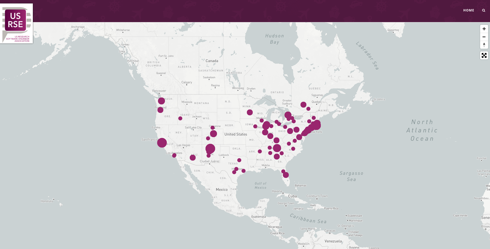

# The US-RSE Map

This repository contains static files and workflows to generate the US-RSE map.



## How does it work?

The map locations are derived from the US-RSE official roster, meaning
that the institutions or companies are exported, and associated
with a location that can be found in the [locations lookup](_data/location-lookup.tsv).
While the final locations and counts are written to the [locations data](_data/locations.csv)
file, **you should not manually update this file** as it is done by a script (see below).
The idea behind using a lookup is that (over time) most locations will be represented,
and so new members to USRSE will simply use these same locations and we'll update the counts
with the GitHub workflow.

### 1. How do I update the map?

You don't! The automated workflow does. The workflow under [.github/workflows/update-map.yml](.github/workflows/update-map.yml)
handles this for you. To add yourself (if you haven't yet) you can fill out the 
institution field under the [join form](https://docs.google.com/forms/d/e/1FAIpQLSdJbPczGHFN8mfMFu_YQym508OzFtOZxfSzr1sOoINxaMmiaw/viewform).


### 2. How do update locations?

The [locations lookup](_data/location-lookup.tsv) is what we update with new institutions.
Basically, it's a lookup of institution name (represented in the roster) and matching
city and state. While the workflow is set up to run this check, you can also do so manually.

```bash
python script/update_lookup.py
```

Whether you run it manually or see a message in a pull request, when you add a location
to the [locations lookup](_data/location-lookup.tsv) you should:

 - ensure that it remains TAB delimited
 - add the location in the correct alphabetical order
 - ensure that the city and state added have a zip code that is locatable (the test will determine this)
 - write the institution (or other name) in alphabetical order
 - the institution must appear as an entry in the actual data export from the form

If you find an institution that doesn't have a location (e.g., it's virtual, or general US) then write in "remote"
for the location. 

### 3. How do we run tests?

Tests are run in a separate workflow at [.github/workflows/main.yml](.github/workflows/main.yml).
Since a contribution will come down to updating the list of locations in the lookup,
we ensure that:

 1. They are all in lowercase
 2. They are actually represented in the form data export
 3. The city/state combinations can be looked up
 4. Locations are sorted in alphabetical order
 5. The file can be read and is TAB delimited.

<!--- ## Join us! --->

<a href="https://docs.google.com/forms/d/e/1FAIpQLScBQ6AYpYYK2wL21egcaVvH0ZEvtShU-0s-XbqnY3okUsyIZw/viewform">
</a> 
