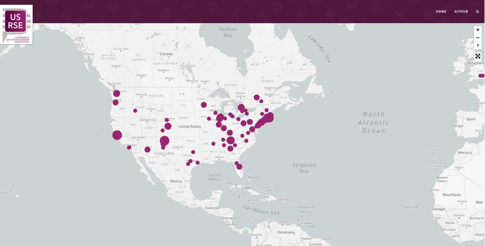

# The US-RSE Map

This repository contains static files and workflows to generate the US-RSE map. We have two versions! A standard map where dots for sizes represent population of RSEng:

And a new heatmap that can better represent the density of an area!

The latter will better support showing our community as it gets larger. The problem with having the points
is that they get very large in some areas and it makes it hard to see.  Both maps
generate from the same data.

## How does it work?

#### Latest

We currently ask participants that fill out
the form to provide a city, town location if they want to anonymously be included in the
map. To minimize needing to use the geolocate API, we still write coordinates to the [locations data](_data/locations.csv) file. **You should not manually update this file** as it is done by a script (see below).

#### June 2020 and Earlier

The map locations are derived from the US-RSE official roster, meaning
that the institutions or companies are exported. In the first implementation, institutions
were associated with a location by way of the [locations lookup](_data/location-lookup.tsv)
and then had matched latitude and longitude coordinates from the (now renamed)
[locations institutions data](_data/locations-institutions.csv).

### 1. How do I add RSE members to the map?

You don't! The automated workflow does. The workflow under [.github/workflows/update-map.yml](.github/workflows/update-map.yml)
handles this for you. To add yourself (if you haven't yet) you can fill out the
institution field under the [join form](https://docs.google.com/forms/d/e/1FAIpQLSdJbPczGHFN8mfMFu_YQym508OzFtOZxfSzr1sOoINxaMmiaw/viewform).

### 2. How do update locations?

The [locations lookup](_data/location-lookup.tsv) used to need monthly updating, but we don't
use it anymore. Look at older versions of this file under the repository version control
to see how this worked.

### 3. How do we run tests?

Tests are run in a separate workflow at [.github/workflows/main.yml](.github/workflows/main.yml).
Since a contribution will come down to updating the list of locations, we ensure that
the fields and types are represented correctly.

### 4. How do I add a regional/local group to the map?

We expect new regional/local groups to be added much less frequently than new RSE members, so this portion is not automated. To add a regional/local group, update the [group locations](_data/group-locations.csv) file to include the new group.

## Google Sheet Issues

The script [scripts/update_map.py](scripts/update_map.py) downloads a static export of a Google Sheet,
which should be updating to generate a list of locations (cities and states) for generation here.
This sheet that is labeled "Locations export for website." The cells are supposed to automatically
update since they have been pre-populated with formulas, but in practice it often doesn't automatically
populate from the first, despite the formula being there. When this happens:

1. You'll see a PR here that is empty. You should close and delete the branch
2. You should open up the sheet, and click and drag down the last cell that is populated with a city/state to populate a new chunk of rows, up until the number of entries we have in the first (private) sheet with full informaiton.
3. You should glance over the new names and look for spelling errors, or any other formatting issues. You can then go back to the first sheet to fix names. Other than spelling, we always need to change "CA" to "California" because most CA entries will show up somewhere in Canada.
4. Once the sheet looks good, you can click the "Actions" tab here to re-run the job.

The pull request should open again, with changes that time, and then you can approve or close and delete and branch and continue tweaking the sheet and running the action until it looks good.

### How could it be improved?

For the long term, it might be less error prone to somehow use the Sheets API instead of the interface,
or to debug why the sheet doesn't auto-populate with correct data as it should.

### To run locally for testing:
In a terminal window in the root project directory, install the gems specified in the gemfile (`bundle install`), then run the jekyll server with `bundle exec jekyll serve` (this will run the exact jekyll version specified in the gemfile, unlike `jekyll serve`). Navigate to [http://localhost:4000/usrse-map/](http://localhost:4000/usrse-map/) to view the page (be sure to include all the slashes).

<!--- ## Join us! --->

